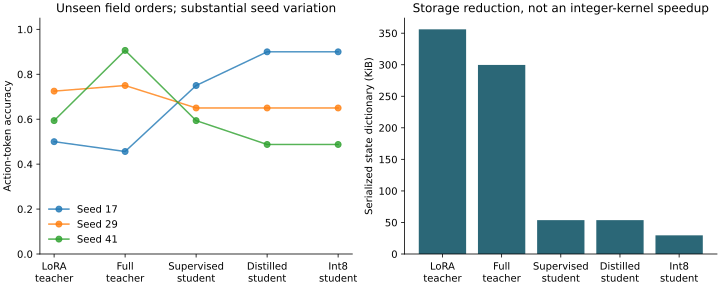

# Small model lab

[](https://github.com/christianwhollar/small-model-lab/actions/workflows/ci.yml)

Train a tiny causal Transformer on synthetic operations text, adapt it with low-rank weights or full fine-tuning, distill into a smaller student, and measure a weight-only int8 variant. This is a compact experimental system whose entire training run fits on a CPU.

This is a runnable reference implementation using synthetic data. See [design notes](docs/design.md), [development provenance](DEVELOPMENT.md), and [verification](docs/verification.md).

## Run locally

Python 3.12 is the tested runtime.

```bash
python3.12 -m venv .venv
source .venv/bin/activate
pip install -c constraints.txt -e '.[dev]'
python -m smallmodel.demo
pytest -q
```

## Study protocol

```bash
python -m smallmodel.experiment --seed 17 --steps 150 --output runtime/seed17.json
python -m smallmodel.experiment --seed 29 --steps 150 --output runtime/seed29.json
python -m smallmodel.experiment --seed 41 --steps 150 --output runtime/seed41.json
```

The task is next-token prediction of one of four action labels after a synthetic ticket. Training, validation, and test use different field-order templates. The vocabulary is a declared closed language, not a general-language tokenizer. A causal-mask test checks that future tokens cannot affect earlier outputs.

The comparison includes:

- A language-pretrained, unadapted base model.
- Low-rank adaptation with the original parameters frozen.
- Full fine-tuning from the same pretrained base.
- A small student trained on labels alone.
- An identically initialized student trained on labels plus teacher logits.
- The distilled student with per-channel int8 stored linear weights.

The distillation teacher is selected using validation accuracy and NLL before evaluating the test templates. All test predictions, losses, parameter counts, serialized sizes, and measured CPU latencies are saved.



Read [the results](reports/analysis.md). Seed variation is substantial, and distillation does not consistently improve on supervised training. This repository preserves those failures.

## What quantization means here

Linear weights are stored as int8 with per-output-channel scales and dequantized to float32 during the forward pass. This reduces serialized storage but is not an optimized integer inference kernel. It can be slower than the floating-point student. The report measures both effects and does not claim an inference speedup.

## Scope

The model is intentionally tiny and trained on synthetic text. It is not a pretrained general-purpose SLM, a production financial classifier, or a reproduction of the large-model results in the cited papers. The first single-seed study was a pilot; protocol v2 added the full-tuning and supervised-student ablations. Seed 17 was already inspected during development. Seeds 29 and 41 were then run under the fixed v2 configuration. Field-order templates are held out from gradient training, but the published study is exploratory rather than a blind benchmark.

References: [LoRA](https://arxiv.org/abs/2106.09685), [knowledge distillation](https://arxiv.org/abs/1503.02531), [PyTorch](https://pytorch.org/).
