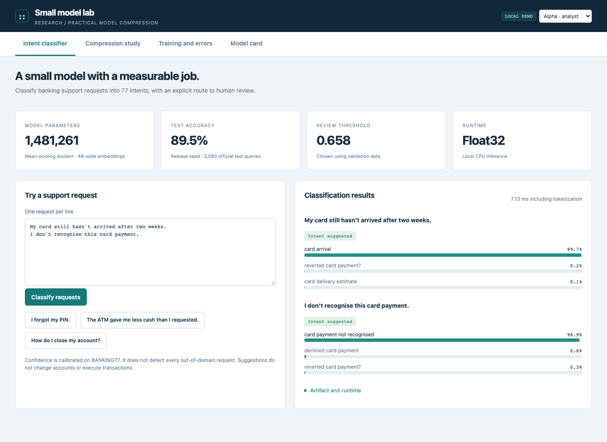
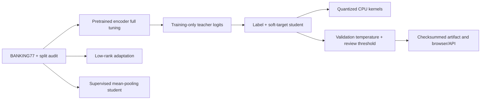
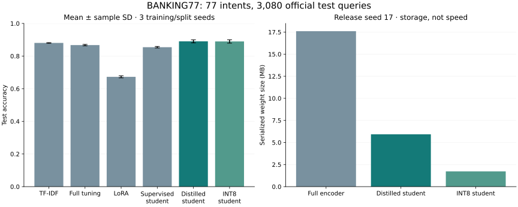

# Small model lab

[](https://github.com/christianwhollar/small-model-lab/actions/workflows/ci.yml)

A complete banking-intent experiment and inference application: adapt a pretrained encoder, train and distill smaller students, measure real CPU quantization, calibrate a review threshold, and serve a checksummed model artifact.



## Start locally

Python 3.12 is the tested runtime. From this repository:

```bash
python3.12 -m venv .venv
source .venv/bin/activate
pip install -c constraints.txt -e '.[dev]'
python -m smallmodel.serve --demo --download-model
```

Open **http://127.0.0.1:8105**. Demo mode binds to loopback and exposes explicit analyst/reviewer identities for synthetic data. It is opt-in; use configured credentials for a hosted service. Interactive API documentation is at `/docs`.

## Run the released model

```bash
python -m smallmodel.serve --demo --download-model
```

The first run downloads a **5.8 MB checksummed release archive** containing safe-tensor student weights, tokenizer files and metadata. It never loads a Python pickle from the release. The browser classifies requests, shows three intent suggestions and confidence, and routes low-confidence examples to human review. Add `--int8` to use real quantized embedding and linear CPU kernels.

The model is an intent classifier, not a generative assistant. It cannot access accounts or execute actions. Confidence is calibrated on BANKING77 and is not a reliable out-of-domain detector.

## Public-data study

The experiment uses **BANKING77: 77 banking intents and 3,080 official test queries**. Normalized duplicate text is removed from training, including overlap with test text. A stratified validation split selects checkpoints and temperature/abstention thresholds. The test labels do not enter those choices.

The teacher starts from the pinned `prajjwal1/bert-tiny` pretrained encoder (4.40M parameters). LoRA adapts attention query/value projections and the classifier (18,125 trainable parameters). The mean-pooling student has 1.48M parameters. Supervised and distilled students start from identical initialization within each seed.

| Approach | Seed 17 | Seed 29 | Seed 41 |
|---|---:|---:|---:|
| TF-IDF logistic baseline | 88.12% | 87.82% | 88.21% |
| Full encoder fine-tuning | 86.27% | 87.11% | 86.82% |
| LoRA | 66.75% | 67.11% | 67.99% |
| Supervised student | 85.91% | 84.97% | 85.45% |
| Distilled student | **89.48%** | **87.99%** | **89.68%** |
| Quantized student | 89.38% | 87.79% | 89.74% |

Distillation improves over the supervised student in all three runs. The lexical baseline remains competitive. This LoRA configuration underperforms; the repository preserves that result rather than claiming parameter efficiency automatically preserves accuracy.

Seed 17 is the release artifact. Its validation-selected threshold accepts 83.96% of test examples with 95.94% accuracy among accepted examples. That selective accuracy is an observed result, not a production guarantee.

Quantization reduces serialized weights from **5.93 MB to 1.73 MB**, using PyTorch's quantized embedding and dynamic linear kernels. It was **slower** than the float student on the measured CPU. Research timing excludes tokenization; the live API reports end-to-end inference processing including tokenization.

[All seed reports and test probabilities](reports/banking77/) · [Study browser data](src/smallmodel/resources/banking77.json) · [Model inference implementation](src/smallmodel/inference.py)

## Reproduce the study

```bash
pip install -c constraints.txt -e '.[research]'
python -m smallmodel.bank_experiment --seed 17 --device cpu --output runtime/seed17
python -m smallmodel.bank_experiment --seed 29 --device cpu --output runtime/seed29
python -m smallmodel.bank_experiment --seed 41 --device cpu --output runtime/seed41
```

Use `--device mps` on a supported Mac or `--device cuda` on a compatible GPU. Published training used MPS; published inference latency used CPU. PyTorch's tested eager quantization API is deprecated upstream, so the constraints file pins the tested runtime. Quantization portability and speed should be remeasured when upgrading it.

Every run saves the protocol before training, dataset checksums, split hashes, learning curves, selected epochs, calibrated predictions, confusion pairs, checkpoint sizes, latency measurements, and paired bootstrap intervals. The study is exploratory; the three seeds give limited evidence about training variability. Bootstrap intervals are conditional on the trained checkpoints.

## Model architecture and serving



The student discards word order, and related intents remain confusable. Model selection is intentionally modest: one fixed training protocol, three seeds, no broad hyperparameter search. The earlier tiny synthetic language-model experiment remains in the repository as a separate educational baseline; it is not the headline study.

Dataset: [BANKING77 / PolyAI](https://github.com/PolyAI-LDN/task-specific-datasets), CC BY 4.0; [Casanueva et al. (2020)](https://arxiv.org/abs/2003.04807). Methods: [LoRA](https://arxiv.org/abs/2106.09685), [knowledge distillation](https://arxiv.org/abs/1503.02531). Pretrained encoder: [bert-tiny model card](https://huggingface.co/prajjwal1/bert-tiny).




## Validation and project notes

```bash
pytest -q
ruff check src tests scripts
```

[Architecture and decisions](docs/design.md) · [Operating guide](docs/operations.md) · [Verification record](docs/verification.md) · [Development provenance](DEVELOPMENT.md)

This is a finished local portfolio application with reproducible experiments and recorded limitations. It does not claim prior production deployment or substitute for operating experience.
